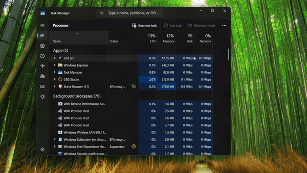
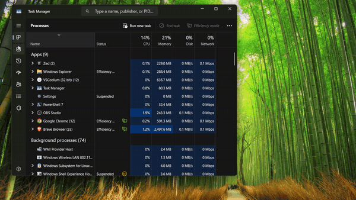

# My Windhawk Mods

Demo media and homepage for my [Windhawk](https://windhawk.net/) mods, published to
the official catalog: <https://github.com/ramensoftware/windhawk-mods>

## MacOS Minimize Animation

Smooth macOS-style genie minimize / restore (open) animations for every window, with
an optional **experimental** app-launch animation (off by default).

## Task Manager Tab Slide Animation

A smooth animated transition - **crossfade** or **slide** - when switching tabs
(Processes, Performance, …) in the Windows 11 Task Manager.

**Crossfade:**

**Slide:**

---

Author: [Abdullah Masood](https://github.com/Abdullah-Masood-05)
